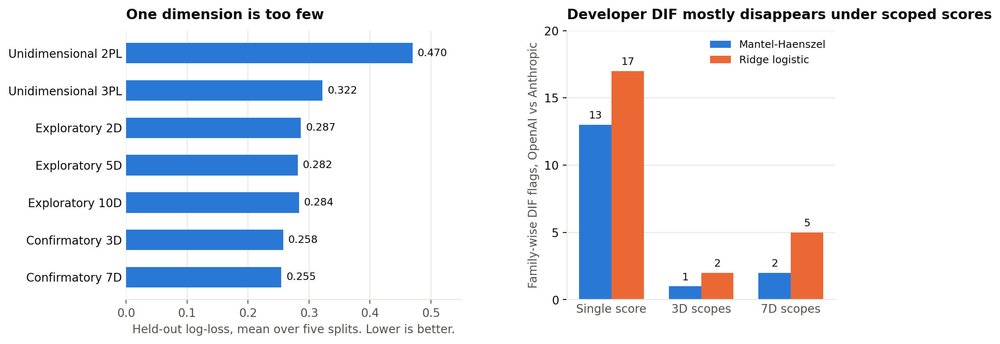
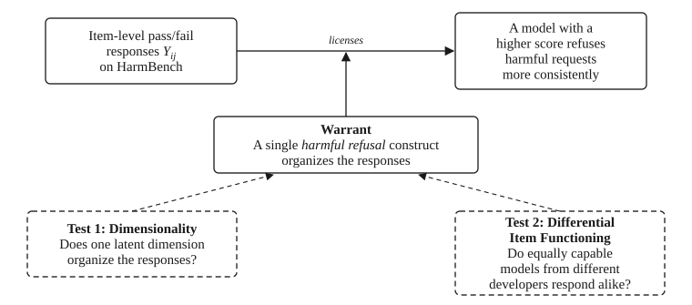

<h1>Searching for “Harmful Refusal”</h1>
<p><strong>A Psychometric Audit of an AI Safety Benchmark</strong></p>

<p align="center">
  <a href="https://colmweb.org/"></a>
  <a href="[paper link]"></a>
  
  
</p>

<p>
Safety leaderboards report one number per model. This repository asks whether the most natural single-attribute reading of that number, a model’s tendency to refuse harmful requests or "harmful refusal", survives two standard psychometric tests for HELM Safety, a popular AI Safety benchmark. For HarmBench, the only HELM Safety component dataset that is not saturated, it does not. We propose treating benchmark scores as claims to be checked rather than a measurement to be trusted.
</p>

<p align="center"></p>

## What we found

**Three of four candidate HELM Safety datasets relevant to _harmful refusal_ are saturated:** AnthropicRedTeam, SimpleSafetyTests, and the harmful subset of XSTest have pass rates near 0.94 across the 81 models in HELM Safety v1.17.0. Almost every model passes almost every item. Only HarmBench, at 0.67, still separates models.

**One dimension is too few for HarmBench:** A unidimensional 2PL model reaches a held-out log-loss of 0.470. Every multidimensional model does far better. A confirmatory three-factor model that separates standard, contextual, and copyright items reaches 0.258 and wins on AIC and BIC. Every one of its twenty restarts beats every restart of the strongest unidimensional model in every split. A follow-up that drops the copyright items still favors a two-factor model over one factor in all five splits.

**Developer-linked differential-item functioning (DIF) appears under the single score and mostly disappears under scoped scores:** Matched on overall ability, OpenAI and Anthropic models still differ on 13 items by Mantel-Haenszel and 17 by a ridge-logistic screen. Score the three item types separately and the counts fall to 1 and 2. While this pattern is consistent with aggregation effects, it does not rule out genuine domain-specific developer differences.

**The single HELM Safety score does not measure a single _harmful refusal_ construct:** A number offered as a measure of one attribute should earn that reading before it is used to compare models. For HarmBench, the reading the evidence supports is a narrow one that keeps the behaviors in its component datasets separate.

## How the audit works

A HarmBench score supports a claim about a model only through a warrant. In our case, the warrant holds that a single *harmful refusal* construct organizes the item responses (Borsboom et al., 2004). The two tests probe that warrant from inside and from outside the response matrix.

<p align="center">
  <picture>
    <source media="(prefers-color-scheme: dark)" srcset="figures/warrant_diagram_dark.svg">
    
  </picture>
</p>

**Test 1** fits exploratory multidimensional 2PL models from one to ten dimensions and two confirmatory models. The three-factor response-process model assigns items to standard, contextual, or copyright. The seven-factor harm-domain model assigns items to HarmBench’s semantic categories. Models are compared by held-out log-loss and Brier score over five repeated 80/20 response-level splits, with twenty random restarts per cell selected on training likelihood only. A Bernoulli-null eigenvalue check on the item-correlation matrix serves as a model-light screen.

**Test 2** asks whether an item is calibrated the same way for two groups of models after matching on fitted ability. The primary screen is Mantel-Haenszel within three ability bands. A ridge-penalized logistic screen with continuous ability is the sensitivity check. Cutoffs come from 5,000 no-DIF response matrices simulated from the fitted IRT model, with a family-wise cutoff at the 95th percentile of the maximum statistic. Two comparisons are fixed in advance. OpenAI against Anthropic, and closed or API models against open-weight-like models.

## Results at a glance

Held-out prediction across five repeated splits. All models are 2PL except the 3PL row, which is the strongest unidimensional comparator. Lower is better in the fit columns.

| Model | d | Fitted quantities | Log-loss | Brier | AIC | BIC |
| --- | ---: | ---: | ---: | ---: | ---: | ---: |
| Unidimensional 2PL | 1 | 877 | 0.470 | 0.156 | 25,806 | 32,961 |
| Unidimensional 3PL | 1 | 1,275 | 0.322 | 0.096 | 17,600 | 28,001 |
| Exploratory 2PL, best of 2D to 10D | 5 | 4,385 | 0.282 | 0.085 | 21,329 | 57,100 |
| Confirmatory 3D response-process | 3 | 1,039 | 0.258 | 0.078 | **13,707** | **22,183** |
| Confirmatory 7D harm-domain | 7 | 1,363 | **0.255** | **0.077** | 13,961 | 25,080 |

Family-wise DIF flags for OpenAI against Anthropic after ability matching. The closed-versus-open comparison produces no family-wise flags in any scope, even though the two groups differ widely in raw mean score, 0.776 against 0.507.

| Matching scope | Items | Mantel-Haenszel | Ridge logistic |
| --- | ---: | ---: | ---: |
| Single HarmBench score | 398 | 13 | 17 |
| 3D scopes, all three item types | 398 | 1 | 2 |
| 7D scopes, all seven harm domains | 398 | 2 | 5 |

Factor correlations in the three-factor model. Standard and contextual items sit close together. Copyright sits apart, which is what the construct predicts once reproduction of memorized text is separated from declining a harmful request.

| | Standard | Contextual | Copyright |
| --- | ---: | ---: | ---: |
| Standard | 1.000 | 0.785 | 0.451 |
| Contextual | 0.785 | 1.000 | 0.603 |
| Copyright | 0.451 | 0.603 | 1.000 |

## Data

The analysis uses HELM Safety release v1.17.0, accessed 21 June 2026. Each item carries a continuous safety score averaged from two LLM judges on a five-point rubric. We binarize strictly at 1.0, so only a unanimous perfect score counts as a pass. HarmBench keeps 398 of 400 items under this rule. The model pool is 81 models after removing six with incomplete per-item data. The full list is in the notebook appendix.

HarmBench supplies two item taxonomies. Three functional categories describe the response process, with 199 standard items, 99 contextual items, and 100 copyright items. Seven semantic categories describe content. Copyright is the one category that appears in both.

## Repository layout

```
.
├── Harmful Refusal Construct Validity.ipynb   Manuscript-aligned notebook
├── figures/
│   ├── harmbench_item_correlation_parallel_analysis_nozoom.png   Bernoulli-null eigenvalue check
│   ├── readme_summary.png                     Summary figure above
│   └── make_readme_figure.py                  Rebuilds readme_summary.png from results/
├── results/                                   CSVs behind the paper’s main tables
│   ├── harmbench_all_model_holdout_comparison*.csv        Model comparison, pooled and by split
│   ├── harmbench_simple3_factor_correlations.csv          3D factor correlations
│   ├── harmbench_domain7_factor_correlations.csv          7D factor correlations
│   ├── harmbench_mh_dif_flag_summary_with_domain7.csv     Mantel-Haenszel DIF flags by scope
│   ├── harmbench_logistic_dif_flag_summary_with_domain7.csv   Ridge-logistic DIF flags by scope
│   ├── harmbench_dif_*_descriptives.csv                   Group sizes and raw means
│   └── harmbench_item_type_*.csv                          Item counts and pass rates by type
└── requirements.txt
```

## Reproducing the analysis

```bash
python -m venv .venv
source .venv/bin/activate
pip install -r requirements.txt
jupyter notebook "Harmful Refusal Construct Validity.ipynb"
```

The setup cells download the relevant HELM Safety runs from Stanford CRFM’s public bucket on first use and rebuild the strict binary response matrix. Downloads are cached under `helm_safety_data/`, which is ignored by git. The notebook then walks through the paper’s results in order and reads the fitted results from `results/`.

The MIRT fits use variational inference in py-irt with pyro as the backend. Each model and split runs twenty random initializations with seeds 0 through 19 for 2,000 epochs of stochastic variational inference with Adam at learning rate 0.01. Fits that produce NaN losses are retried at learning rate 0.005 for 3,000 epochs. The fitted parameter caches are large and are not included here.

To regenerate the summary figure from the result CSVs, run `python figures/make_readme_figure.py` from the repository root.

## Authors

| | |
| --- | --- |
| [Christopher M. Stewart](https://github.com/cmstewart) | Carnegie Mellon University |
| Preston Botter | Indiana University |
| Natalie Sarabosing | Carnegie Mellon University |
| Muye Zhang | Google |
| Rachel Phinnemore | Google |
| Shalini Ghosh | Google |
| Hong Shen | Carnegie Mellon University |
| Hoda Heidari | Carnegie Mellon University |

Questions about the code or the analysis? Let us know at cstewar3@andrew.cmu.edu or cstewm@gmail.com

## Citation

```bibtex
@inproceedings{stewart2026harmfulrefusal,
  title     = {Searching for ``Harmful Refusal'': A Psychometric Audit of an AI Safety Benchmark},
  author    = {Stewart, Christopher M. and Botter, Preston and Sarabosing, Natalie and Zhang, Muye and Phinnemore, Rachel and Ghosh, Shalini and Shen, Hong and Heidari, Hoda},
  booktitle = {AI Measurement Science Workshop at the Conference on Language Modeling (COLM)},
  year      = {2026}
}
```

## Acknowledgments

We thank Jeremy N. V. Miles for his comments on an earlier draft of the manuscript. HELM Safety data are hosted publicly by the Stanford Center for Research on Foundation Models. This work was supported by Google. Any opinions, findings, conclusions, or recommendations expressed in this material are those of the authors and do not
reflect the views of Google or other funding agencies.
